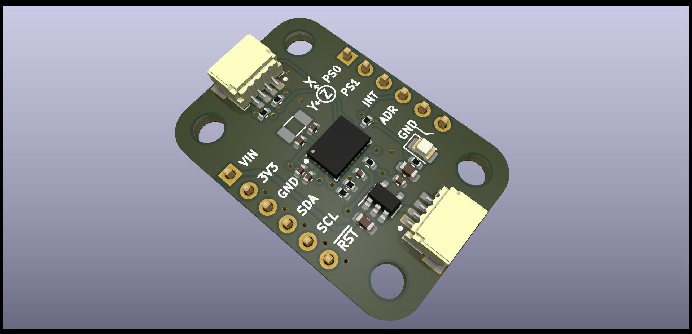
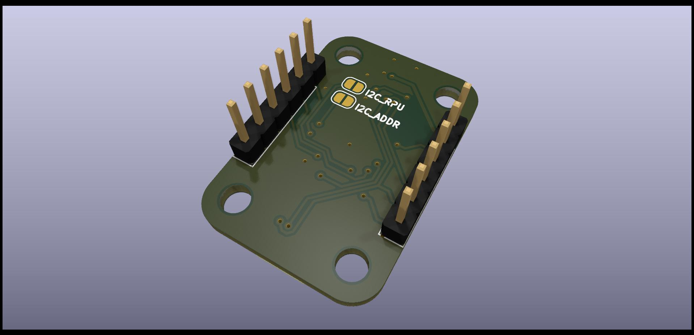
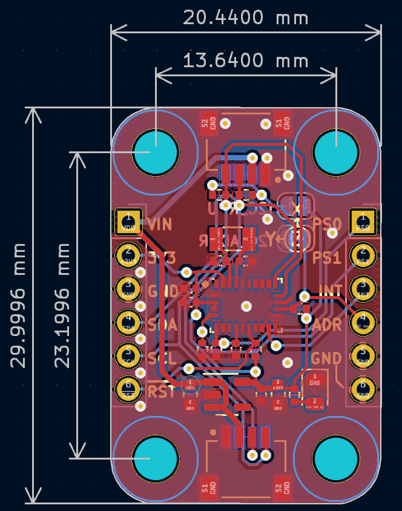

## BNO055
BNO055 sensor breakout board with Adafruit's Stemma QT style connector. All pin and I2C connector is similar to the Adafruit's BNO055 breakout board to ensure the compatibility.

### BNO055 Top

### BNO055 Bottom

### BNO055 PCB dimension
